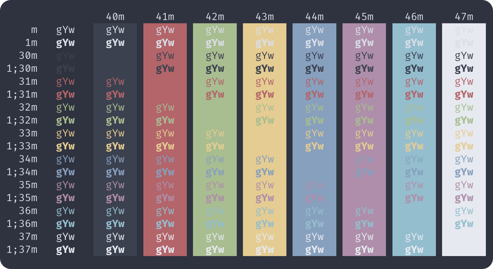

# Nord-Blink

> [Nore color theme](https://www.nordtheme.com) for [Blink Shell](http://www.blink.sh)

## Screenshots

## How to install

- Install [Blink Shell](https://apps.apple.com/app/id1156707581) on your iOS Device.
- Enter `config` to turn on the configuration window.
- Just paste the URL of the JS theme under `Appearance` > `Themes` > `New Theme`.
  - Nord: [https://raw.githubusercontent.com/hwyncho/Nord-Blink/master/Nord.js](https://raw.githubusercontent.com/hwyncho/Nord-Blink/master/Nord.js)
